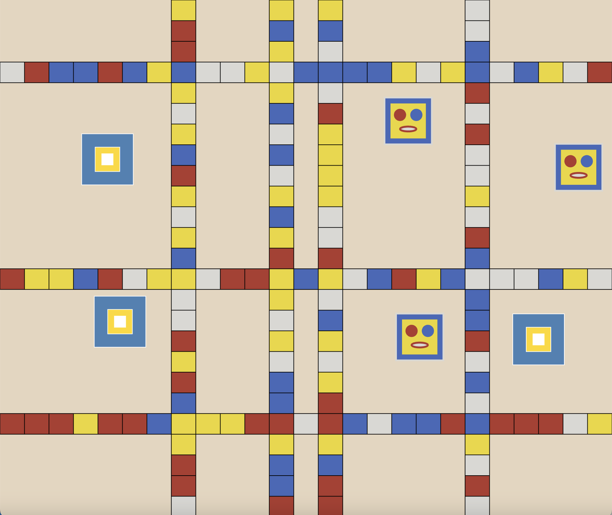
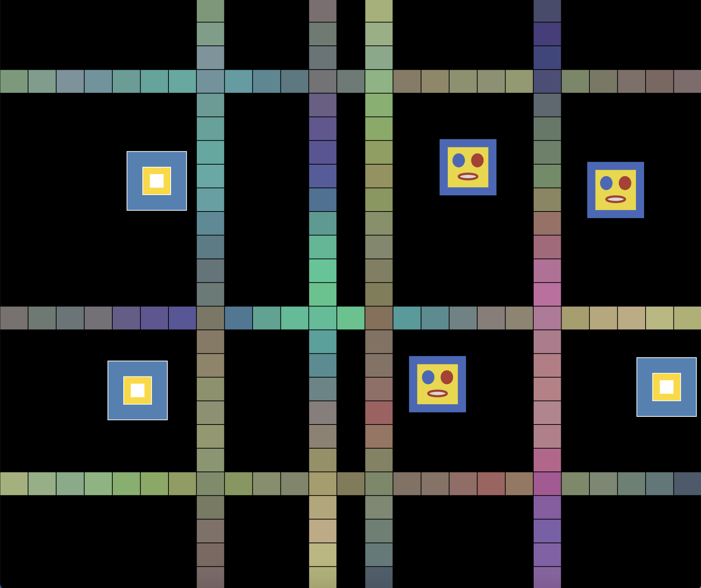

# aset0894_TUT10_GroupB Prototype

## Instructions
There is no user input needed to interact with the prototype. Basically, after loading the page, the user just needs to wait for approximately 3 seconds and it will automatically switch the state to the dark mode with the perlin-noise-colored grid.

    
    

## Details of the individual prototype
I chose Perlin noise to modify the group initial code and produce the individual prototype. My focus is on the color-changing grid lines using noise and mapping the noise to create a smooth colour-changing effect on the grid line.

### 1. The features
The following features make the prototype unique compared to other group members’s individual prototypes with different focuses. Although it still retains the structure of the group code, there are some changes applied as well.

- #### Automatic mode switching (light mode and dark mode)

To still retain the original colour scheme of the artwork but also show the perlin-noise modification in a fun way, I applied two modes that are continuously switching. The light mode depicts the original colour scheme of the artwork, which is the default state, while the dark mode depicts the perlin-noise modification.

- #### Interaction with the character

The colour-changing does not only occur automatically with time; it also involves interaction with the character blocks. The character colliding with the grid line will trigger the colour-changing effect on the grid.

### 2. Reference or Inspiration
The inspiration for this prototype modification comes from the original pacman game with the black background and neon colored pathways, as displayed in the reference image below. 

 
Figure 1. Pacman game (Druid, 2016)

I thought it would be interesting to apply the color scheme of dark background with randomised constranting color, and thus change the original "light mode" to the "dark mode".

### 3. Technical explanation

I made some major changes to the group code. Although it does not appear significantly different, but the changes are intended to make it easier to adjust the modification I made in the individual one. 

- #### Change the grid line generation function to grid line class
Because the main focus is on changing the color of the grid line, the previous group setup did not allow me to dynamically change the colors. It is also easier to apply the "update colors" method inside the grid line class.

- #### Add another mode in the main draw function
To introduce the auto-switch to the dark mode, I implemented the use of frameCount in the main function and utilise it as a condition to either draw the default state or the dark mode state.

Those 2 are the major changes I made to the initial group code.

I also acknowledge the use of ChatGPT in assisting with troubleshooting the code, particularly the application of switchInterval to automatically change the state. Another method I learned that I implemented in the group code is the array.splice() to remove a specific element of an array (mdn, n.d.).

## Reference list
Druid, N. (2016, January 15). Steam community :: Guide :: pac-man - Guide to mastering the maze! Steam Community. https://steamcommunity.com/sharedfiles/filedetails/?id=593226813

MDN Web Docs. (n.d.). Array.prototype.splice(). https://developer.mozilla.org/en-US/docs/Web/JavaScript/Reference/Global_Objects/Array/splice

